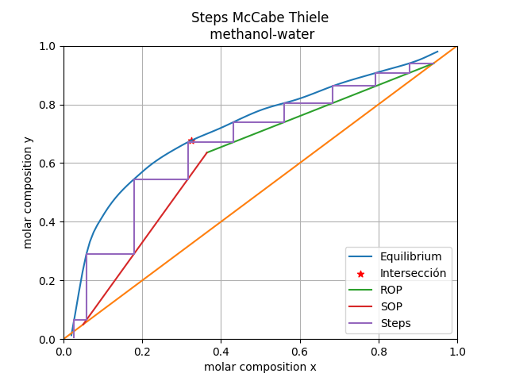
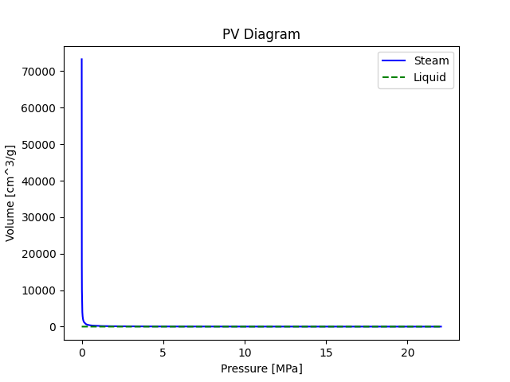
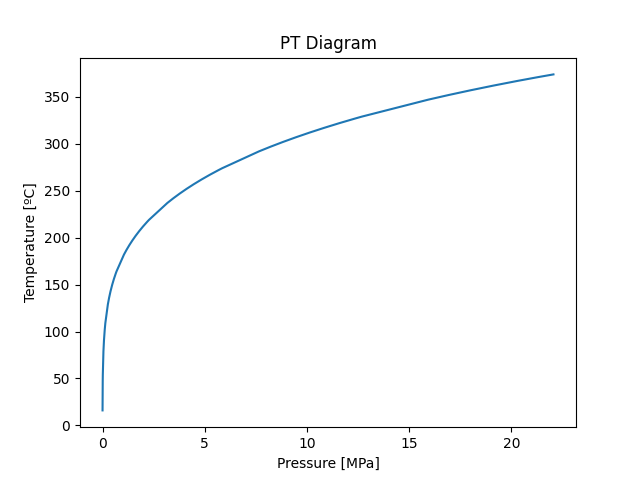
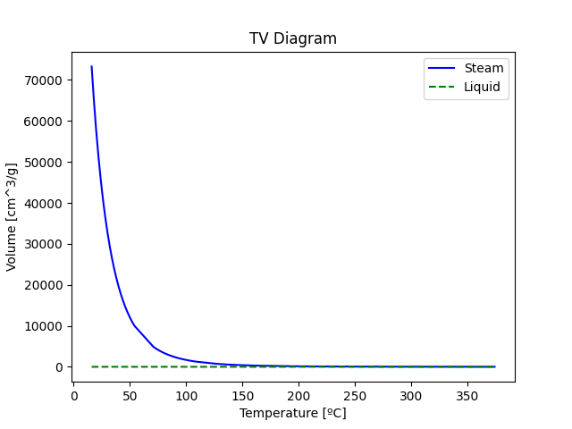
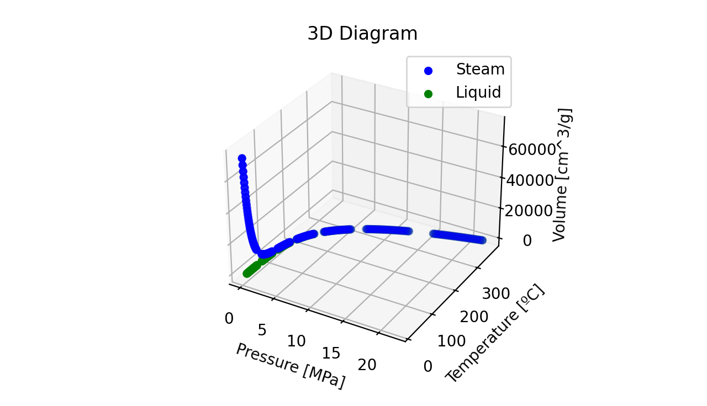

<!-- # Explorando fqlearn: Potenciando el Análisis y Diseño de Procesos Termodinámicos -->

  En este artículo se describe la utilidad que ofrece una visualización sencilla
  de cálculos termodinámicos, útil para el manejo de docentes y el aprendizaje
  por parte de los alumnos interesados en el tema. Usando las funciones disponibles
  en las clases de McCabe-Thiele, y SteamTable.

<!-- TEASER_END -->

# Explorando fqlearn: Potenciando el Análisis y Diseño de Procesos Termodinámicos

En el apasionante mundo de la ingeniería química, la biblioteca `fqlearn` emerge como una herramienta valiosa, ofreciendo capacidades significativas para el análisis y diseño de procesos. Diseñada para mejorar la visualización de datos y servir como una herramienta educativa, `fqlearn` se posiciona como un recurso versátil para ingenieros y científicos en la industria química.

## Implementación de la Clase McCabe-Thiele para Análisis Gráfico de Destilación Binaria en Python

La clase `McCabeThiele` dentro de `fqlearn` brinda funcionalidades especializadas para llevar a cabo cálculos de equilibrio líquido-vapor utilizando el método de McCabe-Thiele. Este método es esencial en el diseño de columnas de destilación, permitiendo determinar el número óptimo de etapas necesarias para separar componentes en una mezcla.

La clase McCabeThiele es una implementación en Python del método de McCabe-Thiele, una técnica gráfica fundamental en el diseño de columnas de destilación para procesos químicos. Este método proporciona una manera visual de analizar y dimensionar sistemas de destilación binaria. A continuación, se presenta una descripción detallada de la clase y sus principales componentes.

# Ejemplo de uso de McCabeThiele en fqlearn

```python
# Importar la clase McCabeThiele de la biblioteca fqlearn
from fqlearn.McCabeThiele import McCabeThiele


# Crear una instancia del modelo McCabeThiele
model = McCabeThiele()

# Establecer los compuestos para el análisis (metanol y agua)
model.set_data(compound_a="methanol", compound_b="water")

# Establecer las composiciones del destilado (xD) y del líquido (xW)
model.set_compositions(xD=0.94, xW=0.05)

# Establecer los parámetros de alimentación (relación de calor q y composición xF)
model.set_feed(q=0.5, xF=0.5)

# Resolver el sistema y calcular el número de etapas necesarias
model.solve()

# Imprimir información relevante sobre el reflujo mínimo y la composición líquida de salida
model.describe()
```
## Función describe

La función 'describe' imprime en pantalla información sobre cada etapa en el proceso de McCabe-Thiele.

- El reflujo mínimo es de: 0.7480780119884876
- La composición líquida de salida: 0.05

### Composición de entrada y salida en cada etapa:
  - Etapa 1: Entrada = 0.9400, Salida = 0.9400
  - Etapa 2: Entrada = 0.8783, Salida = 0.9400
  - Etapa 3: Entrada = 0.8783, Salida = 0.9074
  - Etapa 4: Entrada = 0.7933, Salida = 0.9074
  - Etapa 5: Entrada = 0.7933, Salida = 0.8624
  - Etapa 6: Entrada = 0.6840, Salida = 0.8624
  - Etapa 7: Entrada = 0.6840, Salida = 0.8046
  - Etapa 8: Entrada = 0.5611, Salida = 0.8046
  - Etapa 9: Entrada = 0.5611, Salida = 0.7396
  - Etapa 10: Entrada = 0.4316, Salida = 0.7396

Número total de etapas: 9


```python
# Generar un gráfico que muestra las curvas de equilibrio, la línea de alimentación y las etapas del proceso
model.plot()
```
## Función plot
La función plot de McCabe-Thiele le muestra al usuario la gráfica de destilación binaria, con todas las etapas y demás información que el usuario pueda solicitar



**Ejes:**
Los ejes X e Y representan la composición molar x y y respectivamente, variando de 0 a 1.

**Líneas:**

- *Equilibrio (azul):* Esta línea se extiende diagonalmente a través del gráfico y representa el equilibrio entre las fases líquida y vapor de la mezcla.

- *Intersección (roja):* Esta línea marca un punto específico de intersección entre las curvas ROP y SOP.

- *ROP (naranja):* Representa la línea de operación de rectificación, que es la sección de la columna de destilación por encima del plato de alimentación.

- *SOP (verde):* Representa la línea de operación de agotamiento, que es la sección de la columna de destilación por debajo del plato de alimentación.

- *Pasos (púrpura):* Estos indican los platos teóricos necesarios para la separación. Cada paso representa un plato teórico en la columna de destilación.

Este gráfico es útil para determinar el número de platos teóricos necesarios en una columna de destilación para separar una mezcla de metanol-agua. Los platos teóricos son una medida de la eficiencia de la columna de destilación. Cuantos más platos teóricos tenga una columna, más eficiente será la separación.

**Importancia de la Destilación Binaria de McCabe-Thiele:**

La destilación binaria de McCabe-Thiele es un método crucial en ingeniería química y procesos de separación, utilizado para analizar y diseñar columnas de destilación. A continuación, se detallan algunas de las razones clave por las cuales la destilación binaria de McCabe-Thiele es importante:

**Diseño Eficiente de Columnas de Destilación:**
- Proporciona un enfoque sistemático y gráfico para el diseño de columnas de destilación binarias, permitiendo determinar el número mínimo de etapas requeridas para una separación específica.
- Facilita la comprensión de la eficiencia de una columna de destilación y la relación entre el número de etapas teóricas y reales.

**Optimización de Procesos de Separación:**
- Permite optimizar los procesos de separación de mezclas binarias, como la purificación de componentes en la industria química y petroquímica.
- Ayuda en la selección adecuada de condiciones operativas para lograr la separación deseada de componentes.

**Análisis Detallado de Comportamientos de Mezclas:**
- Proporciona una representación visual y detallada de la composición de las mezclas en cada etapa de la columna de destilación, lo que facilita el análisis del comportamiento de los componentes.
- Permite identificar el reflujo mínimo necesario para una separación específica y evaluar la eficiencia del proceso.

**Entendimiento de Interacciones de Componentes:**
- Ayuda a comprender las interacciones entre los componentes de la mezcla y cómo influyen en el proceso de destilación.
- Permite evaluar la viabilidad y eficiencia de la separación de componentes específicos en una mezcla binaria.

**Herramienta Educativa y de Investigación:**
- Se utiliza como herramienta educativa para estudiantes en ingeniería química y campos relacionados para comprender los principios fundamentales de la destilación.
- Es una herramienta valiosa para la investigación y desarrollo de procesos de destilación más eficientes y sostenibles.

**Análisis de Sistemas de Ingeniería de Procesos:**
- Facilita el análisis de sistemas de ingeniería de procesos que involucran la destilación de mezclas binarias, contribuyendo a la mejora continua y la optimización de operaciones.

## Implementación de la Clase SteamTable para una consulta eficáz de las tablas de vapor

La clase SteamTable ofrece capacidades para gestionar y representar datos termodinámicos asociados con las fases de vapor y líquido, centrándose especialmente en tablas vapor.

Esta función es valiosa en aplicaciones donde se requiere conocer propiedades termodinámicas precisas para una temperatura específica, por ejemplo, en el diseño y análisis de sistemas termodinámicos, procesos de ingeniería, o cualquier escenario donde la temperatura es un parámetro crítico. Proporciona una herramienta flexible y útil para obtener datos detallados en puntos específicos de interés en la tabla termodinámica de vapor.


# Ejemplo de uso de SteamTable en fqlearn
```python
from fqlearn.SteamTable import SteamTable

# Crea una instancia llamada sistema con SteamTable, y carga las tablas en la base de datos
sistema = SteamTable()

# Imprime al usuario las tablas pre-cargadas en la base de datos
sistema.data()

# Le muestra al usuario el gráfico solicitado
sistema.plot('PV')
sistema.plot('PT')
sistema.plot('TV')
sistema.plot3d()

# Le da al usuario información disponible en las tablas con la temperatura proporcionada
sistema.point(t = 100)
```
## Función data

La función 'data' tiene la capacidad de imprimir las tablas de vapor que están cargadas en la base de datos, mostrándolas con incrementos de 20 en 20. Este enfoque permite al usuario visualizar de manera rápida y eficiente la tabla, facilitando así la realización de consultas de forma ágil.


|   t   |     p     |  rhoL  |   rhoV    |   hL   |   hV   | delta_h |    sL    |   sV   | delta_s |   vL    |   vV    |
|-------|-----------|--------|-----------|--------|--------|---------|----------|--------|---------|---------|---------|
| 16.0  | 0.0018188 | 998.9  | 0.013 645 | 67.17  | 2530.2 | 2463.0  | 0.238 97 | 8.757  |  8.518  | 1.0011  | 73286.0 |
| 36.0  | 0.0059479 | 993.64 | 0.041 790 | 150.81 | 2566.3 | 2415.5  | 0.518 67 | 8.3321 | 7.8135  | 1.0064  | 23929.0 |
| 72.0  |   0.034   | 976.58 | 0.215 07  | 301.45 | 2629.5 | 2328.1  | 0.979 49 | 7.7246 | 6.7451  | 1.02398 | 4649.6  |
| 92.0  | 0.075684  | 963.94 | 0.454 91  | 385.46 | 2662.8 | 2277.3  |  1.2160  | 7.4526 | 6.2367  | 1.03741 | 2198.2  |
| 128.0 |  0.2545   | 936.52 |  1.4149   | 537.85 | 2717.3 | 2179.5  |  1.6135  | 7.0465 |  5.433  | 1.06778 | 706.75  |
| 148.0 |  0.45118  | 918.87 |   2.422   | 623.56 | 2743.5 | 2119.9  |  1.8214  | 6.8552 | 5.0337  | 1.0883  | 412.88  |
| 184.0 |  1.0985   | 882.69 |  5.6279   | 780.75 | 2780.6 | 1999.8  |  2.1779  | 6.5525 | 4.3746  | 1.1329  | 177.69  |
| 204.0 |  1.6893   | 859.95 |  8.5186   | 870.35 | 2794.3 | 1923.9  |  2.3683  | 6.4004 | 4.0322  | 1.16286 | 117.39  |
| 240.0 |  3.3469   | 813.37 |  16.749   | 1037.6 | 2803.0 | 1765.4  |  2.702   | 6.1423 | 3.4403  | 1.22946 | 59.705  |
| 260.0 |  4.6923   | 783.63 |  23.712   | 1135.0 | 2796.6 | 1661.6  |  2.8849  | 6.0016 | 3.1167  | 1.27612 | 42.173  |
| 296.0 |  8.1143   | 720.23 |   43.21   | 1322.8 | 2757.0 | 1434.2  |  3.2174  | 5.7373 | 2.5199  | 1.38845 | 23.143  |
| 316.0 |  10.699   | 676.81 |  60.361   | 1437.8 | 2712.3 | 1274.5  |  3.4097  | 5.5729 | 2.1632  | 1.47751 | 16.567  |
| 352.0 |  16.939   | 566.46 |  118.68   | 1687.5 | 2549.6 |  862.1  |  3.8039  | 5.1829 |  1.379  | 1.76536 | 8.4257  |
| 372.0 |  21.554   | 422.26 |  226.84   | 1935.3 | 2275.5 |  340.3  |  4.1785  | 4.7059 | 0.5274  | 2.3682  | 4.4084  |

## Función plot

### Diagrama Presión-Volumen (P-V):
- **Concepto:** Muestra la relación entre la presión y el volumen de un sistema termodinámico.
- **Eje X:** Volumen.
- **Eje Y:** Presión.
- **Características:** En un diagrama P-V, las curvas representan los procesos termodinámicos del sistema. Puede mostrar procesos adiabáticos, isotérmicos, isobáricos, etc. La pendiente de las curvas indica propiedades como la compresibilidad del fluido.



### Diagrama Presión-Temperatura (P-T):
- **Concepto:** Muestra la relación entre la presión y la temperatura de un sistema termodinámico.
- **Eje X:** Temperatura.
- **Eje Y:** Presión.
- **Características:** Este diagrama revela cómo cambia la presión con la temperatura bajo diversas condiciones. Puede mostrar regiones de fases (por ejemplo, líquido, vapor, o ambos) y proporciona información sobre las transiciones de fase.



### Diagrama Temperatura-Volumen (T-V):
- **Concepto:** Muestra la relación entre la temperatura y el volumen de un sistema termodinámico.
- **Eje X:** Volumen.
- **Eje Y:** Temperatura.
- **Características:** Este diagrama ayuda a visualizar cómo la temperatura se relaciona con el volumen en diferentes procesos. Puede mostrar curvas de saturación, isóbaras, entre otras.



Estos diagramas son herramientas esenciales en termodinámica y se utilizan comúnmente para representar y analizar los ciclos termodinámicos, como el ciclo de Carnot en máquinas térmicas. Además, en el caso de sustancias puras, los diagramas P-V, P-T y T-V son útiles para entender las propiedades y comportamientos de la sustancia en diferentes estados termodinámicos. Por ejemplo, el diagrama P-V de una sustancia pura puede revelar información sobre la expansión y la compresión durante un proceso termodinámico.

## Función plot3d

### Diagrama Tridimensional PVT:

- **Ejes:**
  - **Eje X:** Volumen (V)
  - **Eje Y:** Presión (P)
  - **Eje Z:** Temperatura (T)

- **Características:**

  - Este diagrama tridimensional proporciona una representación visual de cómo la presión, el volumen y la temperatura interactúan en un sistema termodinámico.

  - Permite observar las superficies de fases y regiones críticas en función de los cambios en las variables P, V y T.

  - Se utiliza para estudiar propiedades como la expansión y contracción de sustancias, cambios de fase y transiciones críticas.

  - Puede revelar información sobre la estabilidad de las fases y proporcionar una comprensión detallada del comportamiento termodinámico de un fluido.


- **Aplicaciones:**

  - Útil en la industria química y de petróleo para comprender el comportamiento de sustancias en condiciones de presión y temperatura variables.

  - Permite visualizar las áreas de vapor, líquido y fase crítica en un solo diagrama.

  - Ayuda en el diseño y optimización de procesos termodinámicos complejos.


- **Importancia:**

  - Facilita la comprensión de las propiedades físicas de sustancias y su respuesta a cambios en las condiciones ambientales.

  - Ayuda en la predicción de comportamientos críticos, como la formación de fases y puntos críticos.

Este tipo de diagrama es una herramienta valiosa para los ingenieros y científicos que trabajan en el estudio y diseño de sistemas termodinámicos, especialmente en áreas como la química, la ingeniería de procesos y la industria del petróleo y gas.




## Función point
La función 'point' permite al usuario buscar valores en la tabla de vapor introduciendo la temperatura deseada, esta regresa el valor correspondiende de presión, densidad, entalpía, entropía y volumen

### Datos del punto buscado

- Temperatura: 100ºC
- Presión: 0.10142 MPa
- Densidad líquido (rhoL): 958.35 kg/m^3
- Densidad vapor (rhoV): 0.59817 kg/m^3
- Entalpía líquido (hL): 419.17 KJ/kg
- Entalpía vapor (hV): 2675.6 KJ/kg
- Cambio de entalpía (delta_h): 2256.4 KJ/kg
- Entropía líquido (sL): 1.3072 KJ/(kg·K)
- Entropía vapor (sV): 7.3541 KJ/(kg·K)
- Cambio de entropía (delta_s): 6.0469 KJ/(kg·K)
- Volumen líquido (vL): 1.04346 cm^3/g
- Volumen vapor (vV): 1671.8 cm^3/g

**Importancia de las Tablas de Vapor en Termodinámica:**

Las tablas de vapor son herramientas fundamentales en termodinámica para el estudio y análisis de sustancias en estados gaseosos y líquidos, proporcionando información crucial sobre las propiedades termodinámicas de las sustancias. A continuación, se detallan algunas de las razones clave por las cuales las tablas de vapor son esenciales:

**Propiedades Termodinámicas Precisas:**

- Las tablas de vapor contienen datos precisos y experimentales sobre propiedades termodinámicas, como la presión, temperatura, entalpía, entropía, volumen específico y otras.

- Estos datos permiten realizar cálculos precisos en procesos termodinámicos y determinar el comportamiento de las sustancias en diferentes condiciones.

**Diseño y Análisis de Ciclos Termodinámicos:**

- Son esenciales en el diseño y análisis de ciclos termodinámicos, como el ciclo Rankine en plantas de energía, el ciclo de refrigeración por compresión de vapor, y otros procesos de conversión de energía.

- Facilitan la identificación de puntos críticos, condiciones de saturación, y la comprensión de las fases involucradas en estos ciclos.

**Predicción de Comportamientos en Procesos Térmicos:**
- Permiten predecir cómo una sustancia se comportará bajo diversas condiciones de temperatura y presión, facilitando la planificación y operación eficiente de sistemas termodinámicos.

- Ayudan en la identificación de transiciones de fase, como la vaporización y la condensación, y proporcionan datos sobre las condiciones críticas.

**Determinación de Propiedades en Ingeniería y Ciencias Aplicadas:**

- En ingeniería química, mecánica y otras disciplinas, las tablas de vapor son utilizadas para calcular y analizar procesos, desde la producción de energía hasta el diseño de sistemas de climatización.

- Facilitan la determinación de propiedades clave necesarias en el diseño y operación de equipos y maquinaria.

**Análisis de Problemas de Transferencia de Calor y Masa:**

- Son esenciales para el análisis de problemas relacionados con la transferencia de calor y masa, proporcionando datos para calcular tasas de evaporación, coeficientes de transferencia de calor, y más.

- Ayudan en la comprensión de fenómenos como la condensación y evaporación en intercambiadores de calor.

**Entendimiento de Comportamientos de Sustancias Puras:**

- Para sustancias puras, las tablas de vapor son fundamentales para entender cómo las propiedades termodinámicas varían en diferentes estados, lo que es esencial para la investigación y el desarrollo de nuevos materiales y procesos.

En resumen, las tablas de vapor son una herramienta invaluable en la termodinámica aplicada, proporcionando datos cruciales que permiten comprender, diseñar y optimizar una amplia variedad de sistemas y procesos en ingeniería y ciencia.

# Conclusiones
En este artículo, hemos explorado la utilidad y aplicaciones prácticas de las funciones disponibles en las clases de McCabe-Thiele y SteamTable de fqlearn. La capacidad de visualizar de manera sencilla cálculos termodinámicos demuestra ser invaluable, especialmente para docentes que buscan simplificar la enseñanza y para alumnos que desean comprender de manera efectiva los conceptos termodinámicos. La combinación de estas herramientas en fqlearn proporciona una plataforma integral que facilita tanto la instrucción como el aprendizaje en el fascinante campo de la termodinámica.

## Repositorio en GitHub

No olvides que puedes consultar fqlearn en [Github](https://github.com/osl-pocs/fqlearn)

## Contácto

El autor de este artículo se encuentra disponible en [LinkedIn](linkedin.com/in/josé-maría-garcía-márquez-556a75199/), en [Github](github.com/JoseMariaGarciaMarquez), y en su [página](www.josemaria.me)